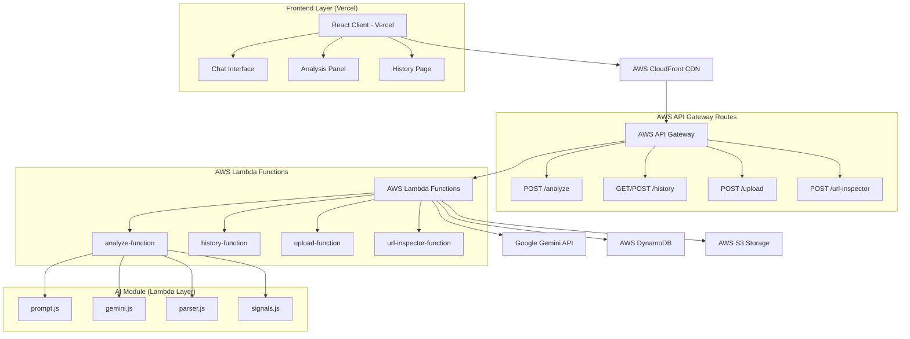

# Design Document

## Overview

The Scam Hunt Platform is a React web application with complete separation of concerns: frontend deployed on Vercel for optimal edge performance, and backend infrastructure entirely on AWS for scalability and security. The system features a conversational AI interface powered by Google Gemini for real-time scam analysis, with AWS Lambda functions handling all backend logic, AWS API Gateway managing API routing, and comprehensive AWS services for data storage, file handling, and global content delivery.

## Architecture

### High-Level Architecture



### Technology Stack

**Frontend (Vercel Deployment):**

- **Framework**: React 18+ with Next.js for optimal build performance and SSR capabilities
- **Language**: TypeScript for type safety
- **Styling**: Tailwind CSS v4 with custom matte black theme
- **Package Manager**: pnpm for efficient dependency management
- **Deployment**: Vercel with edge optimization and global CDN

**Backend (AWS Infrastructure):**

- **Compute**: AWS Lambda functions with Node.js 20 runtime
- **API Management**: AWS API Gateway with REST API and WebSocket support
- **Database**: AWS DynamoDB with on-demand scaling
- **File Storage**: AWS S3 with CloudFront integration
- **CDN**: AWS CloudFront for global content delivery
- **Authentication**: AWS Cognito for future user management
- **Monitoring**: AWS CloudWatch for logging and metrics

**AI Integration:**

- **AI Model**: Google Gemini 2.5 Pro via @google/genai SDK
- **Processing**: Server-side AI processing in Lambda functions
- **Streaming**: WebSocket connections for real-time AI responses

## Components and Interfaces

### Frontend Components

#### ChatInterface Component

```typescript
interface ChatInterfaceProps {
  onAnalysisComplete: (analysis: AnalysisResult) => void;
}

interface Message {
  id: string;
  role: 'user' | 'assistant';
  content: string;
  timestamp: Date;
  imageUrl?: string;
}
```

**Responsibilities:**

- Render conversation history with message bubbles
- Handle user text input with real-time validation
- Manage image upload flow with preview
- Display streaming AI responses with typing indicators
- Provide quick action buttons for common analysis types
- Handle error states and retry mechanisms

#### AnalysisPanel Component

```typescript
interface AnalysisResult {
  riskScore: number;
  credibilityScore: number;
  classification: 'SAFE' | 'SUSPICIOUS' | 'HIGH_RISK';
  detectedRules: DetectedRule[];
  recommendations: string[];
  reasoning: string;
}

interface DetectedRule {
  id: string;
  name: string;
  severity: 'LOW' | 'MEDIUM' | 'HIGH';
  description: string;
  points: number;
}
```

**Responsibilities:**

- Parse JSON analysis results from AI responses
- Render dual-gauge visualization for risk/credibility scores
- Display detected rules as color-coded flag cards
- Show actionable recommendations
- Provide feedback buttons (thumbs up/down)

#### Custom Hooks

##### useScamAnalysis Hook

```typescript
interface UseScamAnalysisReturn {
  messages: Message[];
  isLoading: boolean;
  error: string | null;
  sendMessage: (content: string, imageUrl?: string) => Promise<void>;
  clearConversation: () => void;
  currentAnalysis: AnalysisResult | null;
}
```

**Responsibilities:**

- Manage conversation state and message history
- Handle streaming responses from /api/analyze
- Parse final JSON analysis from AI response
- Manage loading states and error handling
- Trigger history saving on analysis completion

### Backend API Design

#### /api/analyze Endpoint

```typescript
interface AnalyzeRequest {
  message: string;
  imageUrl?: string;
  conversationHistory: Message[];
}

interface AnalyzeResponse {
  // Streaming text response ending with JSON analysis
}
```

**Implementation:**

- Validates and sanitizes input using lib/safety-filters.ts
- Constructs multimodal prompts for text and image analysis
- Streams Gemini API responses directly to client
- Handles image processing server-side with AWS S3 integration
- Implements rate limiting and error handling

#### /api/history Endpoint

```typescript
interface HistoryEntry {
  id: string;
  timestamp: Date;
  analysis: AnalysisResult;
  conversation: Message[];
  userAgent: string;
}
```

**Operations:**

- GET: Retrieve user's analysis history
- POST: Save new analysis with conversation
- GET /[id]: Retrieve specific analysis by ID
- Implements anonymous user identification

#### /api/upload Endpoint

```typescript
interface UploadResponse {
  url: string;
  size: number;
  contentType: string;
}
```

**Implementation:**

- Accepts multipart/form-data with image files
- Validates file type and size (max 10MB)
- Streams directly to AWS S3 storage
- Returns secure S3 URL for analysis

### AI Module Architecture

#### lib/ai/prompt.ts

Contains the master system instruction defining:

- AI persona as "Scam Hunter" expert analyst
- Dual-score framework requirements
- False positive mitigation strategies
- Safe donation protocol enforcement
- Structured JSON output format requirements

#### lib/ai/gemini.ts

```typescript
interface GeminiClient {
  analyzeContent(prompt: string, imageUrl?: string): AsyncIterable<string>;
  fetchImageAsBase64(url: string): Promise<string>;
}
```

**Responsibilities:**

- Encapsulate all Gemini API interactions
- Handle multimodal input processing
- Manage streaming response generation
- Convert images to base64 server-side

#### lib/ai/signals.ts

```typescript
interface RiskSignal {
  id: string;
  name: string;
  category: 'ACCOUNT' | 'CONTENT' | 'BEHAVIORAL' | 'TECHNICAL';
  points: number;
  severity: 'LOW' | 'MEDIUM' | 'HIGH';
  description: string;
}
```

Defines comprehensive risk detection framework:

- Account-based signals (age, verification, activity patterns)
- Content-based signals (urgency language, donation requests)
- Behavioral signals (impersonation tactics, emotional manipulation)
- Technical signals (suspicious URLs, image metadata)

## Data Models

### Analysis Storage Schema

```typescript
interface StoredAnalysis {
  id: string;
  userId: string; // Anonymous identifier
  timestamp: Date;
  input: {
    message: string;
    imageUrl?: string;
  };
  result: AnalysisResult;
  conversation: Message[];
  feedback?: 'positive' | 'negative';
  metadata: {
    userAgent: string;
    ipHash: string;
    processingTime: number;
  };
}
```

### User Session Management

```typescript
interface UserSession {
  id: string;
  createdAt: Date;
  lastActive: Date;
  analysisCount: number;
  feedbackGiven: number;
}
```

## Error Handling

### Client-Side Error Handling

- Network connectivity issues with retry mechanisms
- Invalid file upload handling with user feedback
- Streaming interruption recovery
- Graceful degradation for missing features

### Server-Side Error Handling

- Gemini API rate limiting and quota management
- AWS DynamoDB unavailability with in-memory fallback
- AWS S3 upload failures with detailed error messages
- Input validation errors with sanitization

### Error Response Format

```typescript
interface ErrorResponse {
  error: string;
  code: string;
  details?: Record<string, any>;
  retryable: boolean;
}
```

## Testing Strategy

### Unit Testing

- AI module functions (prompt generation, response parsing)
- Utility functions (safety filters, data validation)
- React component logic (hooks, state management)
- API route handlers (input validation, response formatting)

### Integration Testing

- End-to-end analysis flow (input → AI → visualization)
- File upload and processing pipeline
- History storage and retrieval
- Error handling scenarios

### Performance Testing

- Streaming response latency measurement
- Concurrent user analysis handling
- Memory usage during image processing
- Database query optimization

### Security Testing

- Input sanitization effectiveness
- API key exposure prevention
- Rate limiting enforcement
- File upload security validation

## Performance Considerations

### Client-Side Optimization

- React component memoization for expensive renders
- Lazy loading for history pages
- Image compression before upload
- Debounced input validation

### Server-Side Optimization

- Vercel Serverless deployment for global distribution
- Streaming responses to reduce perceived latency
- Efficient image processing with AWS S3 integration
- Connection pooling for AWS services and external API calls

### Caching Strategy

- Static asset caching with CDN
- API response caching for repeated queries
- Client-side conversation history caching
- S3 URL caching for uploaded images

## Security Implementation

### Input Validation

- Comprehensive sanitization using DOMPurify
- File type and size validation
- Rate limiting per IP and session
- Content Security Policy headers

### Data Protection

- Server-side API key management
- Encrypted storage for sensitive data
- Anonymous user identification
- Secure S3 presigned URL generation with expiration

### Authentication & Authorization

- Anonymous session management
- IP-based rate limiting
- Future-ready user authentication hooks
- Role-based access control preparation
